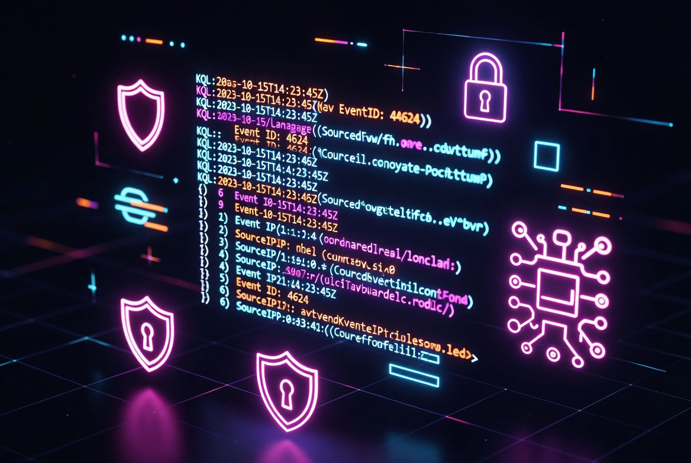

# Hi, I'm Joe

### SOC Engineer | Detection Engineer | Security Operations

 

---

## About Me

I build detection logic for production security operations. My focus is identity-based threat detection in cloud environments. I write KQL analytic rules for Microsoft Sentinel, develop custom Wazuh rules for endpoint coverage, and build enrichment scripts that give analysts the context they need to triage faster.

I work within the MITRE ATT&CK framework because measurable coverage matters more than theoretical capability. Every detection I write maps to a technique, ships with documentation, and gets tested against realistic log data before deployment.

---

## Skills & Tools

| Category              | Tools & Technologies |
|-----------------------|----------------------|
| **Detection**         | KQL, Microsoft Sentinel, Wazuh |
| **Scripting**         | Python, PowerShell, Bash |
| **Cloud & SIEM**      | Azure, Microsoft Sentinel |
| **Frameworks**        | MITRE ATT&CK, Zero Trust |
| **Endpoint**          | Linux, Windows, Sysmon |

---

## Featured Project

### [SOC Capstone](https://github.com/DrJekl90/soc-capstone) - Cloud Identity Threat Detection

End-to-end detection engineering project targeting identity-based attacks in Azure AD.

- 10 KQL analytic rules for Microsoft Sentinel
- 5 custom Wazuh detection rules
- Full automation and enrichment toolkit
- All mapped to MITRE ATT&CK with realistic sample logs

**Detections include:** Impossible Travel, MFA Fatigue, Token Replay, OAuth Consent Phishing, Privilege Escalation, Password Spraying, and more.

---

## GitHub Stats

  

---

## Let's Connect

---

**Detection-first thinking. Operational realism. Documentation as a deliverable.**

