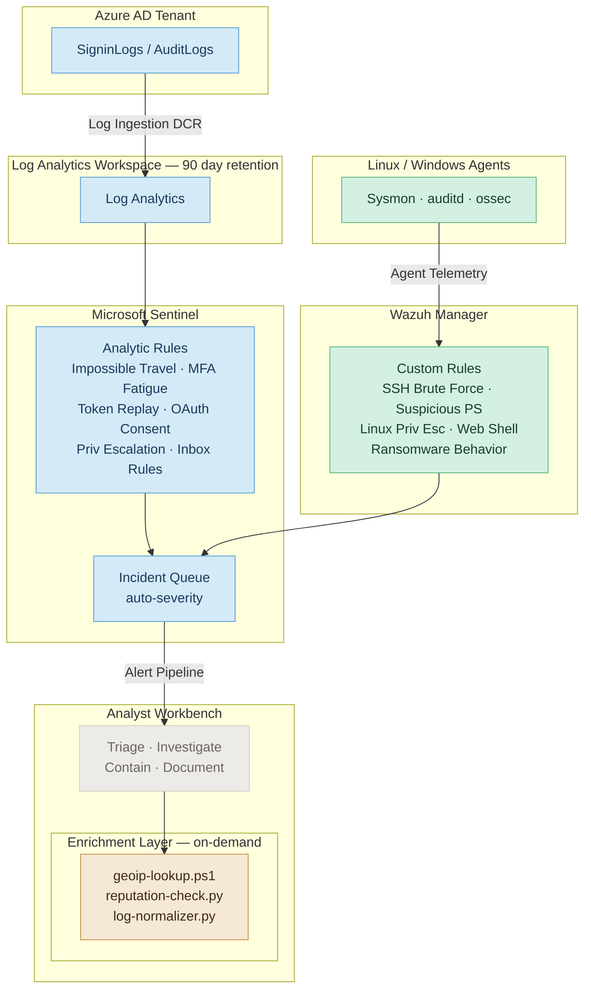

```mermaid
flowchart TD
    subgraph azure["Azure AD Tenant"]
        AAD[SigninLogs / AuditLogs]
    end

    AAD -->|Log Ingestion DCR| LAW

    subgraph law["Log Analytics Workspace — 90 day retention"]
        LAW[Log Analytics]
    end

    LAW --> SENT

    subgraph cloud["Microsoft Sentinel"]
        SENT[Analytic Rules\nImpossible Travel · MFA Fatigue\nToken Replay · OAuth Consent\nPriv Escalation · Inbox Rules]
        SENT --> IQ[Incident Queue\nauto-severity]
    end

    subgraph wazuh["Wazuh Manager"]
        WM[Custom Rules\nSSH Brute Force · Suspicious PS\nLinux Priv Esc · Web Shell\nRansomware Behavior]
    end

    subgraph endpoints["Linux / Windows Agents"]
        AG[Sysmon · auditd · ossec]
    end

    AG -->|Agent Telemetry| WM
    WM --> IQ

    IQ -->|Alert Pipeline| AW

    subgraph analyst["Analyst Workbench"]
        AW[Triage · Investigate\nContain · Document]
        AW --> ENRICH
        subgraph enrich["Enrichment Layer — on-demand"]
            ENRICH[geoip-lookup.ps1\nreputation-check.py\nlog-normalizer.py]
        end
    end

    classDef blue fill:#d4eaf7,stroke:#5a9fd4,color:#1a3a5c
    classDef green fill:#d4f0e2,stroke:#5ab882,color:#1a3d2b
    classDef amber fill:#f5e8d4,stroke:#c89050,color:#3d2a1a
    classDef neutral fill:#edebe7,stroke:#d0ccc5,color:#6a6760

    class AAD,LAW,SENT,IQ blue
    class WM,AG green
    class ENRICH amber
    class AW neutral
```
