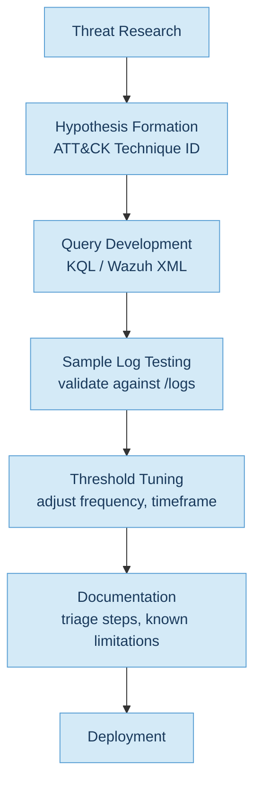
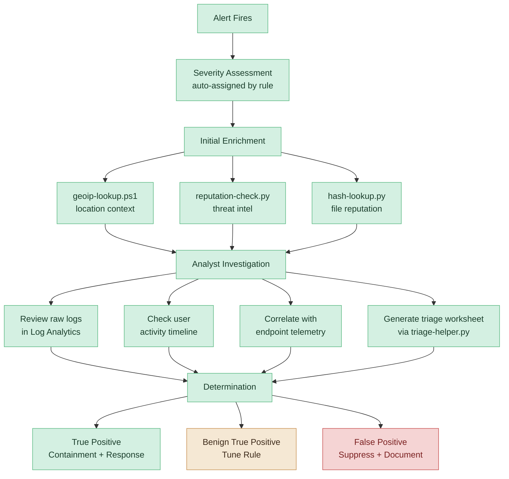
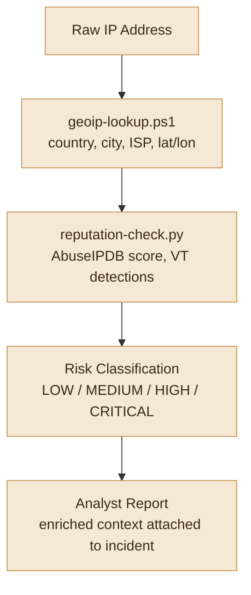
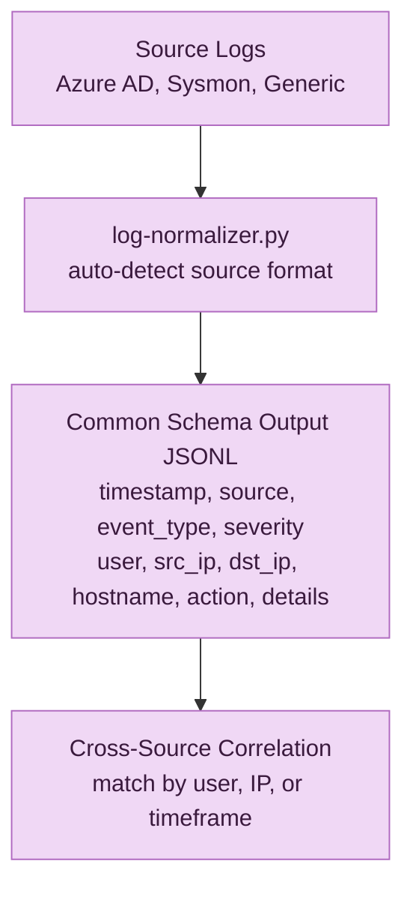
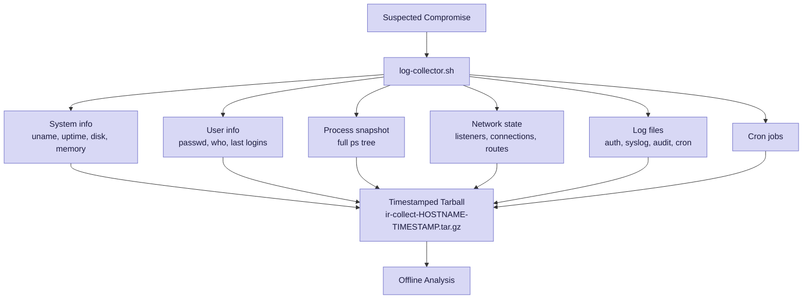

# Workflow Diagrams

## Detection Rule Development Lifecycle

---

## Incident Triage Workflow

---

## Enrichment Pipeline

---

## Log Normalization Flow

---

## Incident Response Collection Flow

